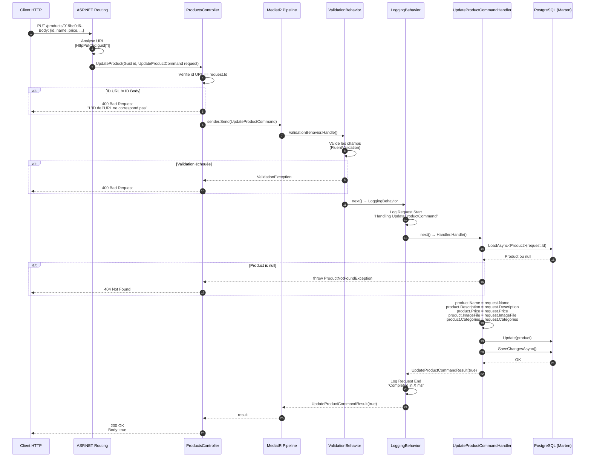

# Diagramme de Séquence - UpdateProduct

## Vue d'ensemble

Ce document décrit le parcours complet d'une requête `PUT /products/{id}` pour mettre à jour un produit dans le Catalog API.

---

## Diagramme de Séquence



---

## Description des étapes

| # | Composant | Action |
|---|-----------|--------|
| 1 | Client HTTP | Envoie `PUT /products/{id}` avec le body JSON |
| 2 | ASP.NET Routing | Analyse l'URL et trouve la méthode `[HttpPut("{id:guid}")]` |
| 3 | Controller | Reçoit `Guid id` (URL) et `UpdateProductCommand` (Body) |
| 4 | Controller | Vérifie que l'ID de l'URL == ID du Body |
| 5 | MediatR | Reçoit la commande et démarre le pipeline |
| 6 | ValidationBehavior | Valide les champs avec FluentValidation |
| 7 | LoggingBehavior | Log le début de la requête |
| 8 | Handler | Charge le produit depuis PostgreSQL |
| 9 | Handler | Vérifie que le produit existe |
| 10 | Handler | Met à jour les propriétés du produit |
| 11 | Handler | Sauvegarde en base de données |
| 12 | LoggingBehavior | Log la fin de la requête |
| 13 | Controller | Retourne `200 OK` avec `true` |

---

## Fichiers impliqués

```
Catalog.API/
├── Controllers/
│   └── ProductsController.cs          ← Point d'entrée HTTP
│
├── Features/Products/Commands/UpdateProduct/
│   ├── UpdateProductCommand.cs        ← DTO (transporte les données)
│   ├── UpdateProductCommandHandler.cs ← Logique métier
│   └── UpdateProductCommandResult.cs  ← DTO de réponse
│
└── Program.cs                         ← Configuration MediatR
```

---

## Codes de réponse HTTP

| Code | Condition | Description |
|------|-----------|-------------|
| `200 OK` | Succès | Produit mis à jour avec succès |
| `400 Bad Request` | ID URL ≠ ID Body | Les IDs ne correspondent pas |
| `400 Bad Request` | Validation échouée | Champs invalides |
| `404 Not Found` | Produit inexistant | Aucun produit avec cet ID |

---

## Exemple de requête

```http
PUT http://localhost:5240/products/019bc0d6-4539-47f1-a5ad-0ab2311ffcc5
Content-Type: application/json

{
    "id": "019bc0d6-4539-47f1-a5ad-0ab2311ffcc5",
    "name": "New Product Updated dj",
    "categories": ["c1", "c2", "c3", "c4"],
    "description": "Description Product A",
    "imageFile": "Image file Product A after update",
    "price": 280
}
```

## Exemple de réponse

```http
HTTP/1.1 200 OK
Content-Type: application/json

true
```

---

## Architecture CQRS

```
┌─────────────────────────────────────────────────────────────┐
│                         CLIENT                              │
└─────────────────────────────────────────────────────────────┘
                              │
                              ▼
┌─────────────────────────────────────────────────────────────┐
│                       CONTROLLER                            │
│                  (Couche Présentation)                      │
└─────────────────────────────────────────────────────────────┘
                              │
                              ▼
┌─────────────────────────────────────────────────────────────┐
│                        COMMAND                              │
│                    (DTO - Message)                          │
│              UpdateProductCommand(Id, Name, ...)            │
└─────────────────────────────────────────────────────────────┘
                              │
                              ▼
┌─────────────────────────────────────────────────────────────┐
│                        MEDIATR                              │
│                    (Mediator Pattern)                       │
│         ┌─────────────┐    ┌─────────────┐                  │
│         │ Validation  │ →  │  Logging    │                  │
│         └─────────────┘    └─────────────┘                  │
└─────────────────────────────────────────────────────────────┘
                              │
                              ▼
┌─────────────────────────────────────────────────────────────┐
│                        HANDLER                              │
│                  (Couche Application)                       │
│              UpdateProductCommandHandler                    │
│                                                             │
│         1. Load Product from DB                             │
│         2. Update properties                                │
│         3. Save to DB                                       │
└─────────────────────────────────────────────────────────────┘
                              │
                              ▼
┌─────────────────────────────────────────────────────────────┐
│                      DATABASE                               │
│                (Couche Infrastructure)                      │
│              PostgreSQL via Marten                          │
└─────────────────────────────────────────────────────────────┘
```
