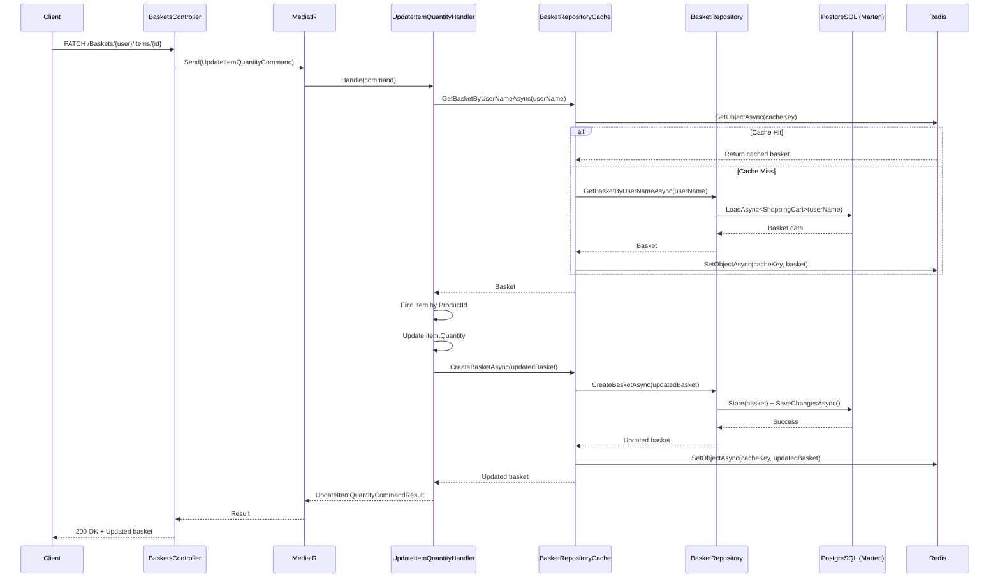

# ADR-007 : Opérations Granulaires sur les Articles du Panier

## Statut
**Accepté** - 2026-02-02

## Contexte

Le service Basket permettait initialement de :
- ✅ Créer/mettre à jour un panier complet
- ✅ Récupérer un panier par username
- ✅ Supprimer un panier entier

Cependant, il manquait des opérations **granulaires** essentielles pour une expérience utilisateur optimale :
- ❌ Modifier la quantité d'un seul article
- ❌ Supprimer un article spécifique sans vider tout le panier

Sans ces fonctionnalités, un simple changement de quantité nécessitait de **reconstruire et renvoyer l'intégralité du panier** côté client, augmentant :
- La **complexité côté frontend**
- Le **risque d'erreurs** (incohérences de données)
- La **bande passante** (payload plus large)

## Décision

Nous avons décidé d'implémenter **deux nouvelles commandes CQRS** pour permettre des modifications granulaires du panier :

### 1️⃣ UpdateItemQuantity

**Endpoint** : `PATCH /Baskets/{userName}/items/{productId}`

**Commande** :
```csharp
public record UpdateItemQuantityCommand(
    string UserName,
    Guid ProductId,
    int Quantity
) : ICommand<UpdateItemQuantityCommandResult>;
```

**Flux** :
1. Récupérer le panier de l'utilisateur
2. Trouver l'article correspondant au `ProductId`
3. Mettre à jour uniquement la propriété `Quantity`
4. Persister le panier via le repository
5. Invalider le cache Redis

---

### 2️⃣ DeleteBasketItem

**Endpoint** : `DELETE /Baskets/{userName}/items/{productId}`

**Commande** :
```csharp
public record DeleteBasketItemCommand(
    string UserName,
    Guid ProductId
) : ICommand<DeleteBasketItemCommandResult>;
```

**Flux** :
1. Récupérer le panier de l'utilisateur
2. Filtrer la collection `Items` pour retirer le produit
3. Persister le panier mis à jour
4. Invalider le cache Redis

---

## Architecture

### Pattern CQRS

Chaque commande suit la structure standard du projet :

```
Features/Baskets/Commands/{CommandName}/
├── {CommandName}Command.cs
├── {CommandName}CommandResult.cs
├── {CommandName}CommandValidator.cs
└── {CommandName}CommandHandler.cs
```

### Validation avec FluentValidation

**UpdateItemQuantity** :
- `UserName` : non vide
- `ProductId` : GUID valide
- `Quantity` : > 0

**DeleteBasketItem** :
- `UserName` : non vide
- `ProductId` : GUID valide

### Gestion du Cache

Les opérations suivent le pattern **Cache-Aside** avec invalidation :

```csharp
// BasketRepositoryCache (Decorator Pattern)
public async Task<ShoppingCart> CreateBasketAsync(ShoppingCart basket, ...)
{
    var createdBasket = await repository.CreateBasketAsync(basket, ...);
    var cacheKey = GenerateKey(basket.UserName);
    await cache.SetObjectAsync(cacheKey, createdBasket, ...); // ✅ Mise à jour cache
    return createdBasket;
}
```

Le `BasketRepositoryCache` décorateur s'occupe **automatiquement** de :
1. Invalider l'ancien cache
2. Appeler le repository sous-jacent
3. Mettre en cache la nouvelle version

---

## Alternatives Considérées

| Alternative | Avantages | Inconvénients | Décision |
|-------------|-----------|---------------|----------|
| **Approche granulaire (PATCH/DELETE item)** | API RESTful, moins de données, moins de complexité client | Plus d'endpoints à maintenir | ✅ **Choisi** |
| **Remplacement complet du panier (PUT)** | Un seul endpoint | Client doit gérer tout le state, risque d'overwrite | ❌ Rejeté |
| **Méthodes dans le Repository** | Séparation des responsabilités | Duplication de logique (cache + DB) | ❌ Rejeté |

### Pourquoi pas des méthodes dédiées dans le Repository ?

Nous aurions pu ajouter :
```csharp
Task<ShoppingCart> UpdateBasketItemQuantityAsync(...);
Task<ShoppingCart> DeleteBasketItemAsync(...);
```

**Rejeté car** :
- Ces méthodes feraient la **même chose** que `CreateBasketAsync` (Store + SaveChanges)
- Duplication de code entre `BasketRepository` et `BasketRepositoryCache`
- Marten traite les modifications de documents via `Store()`, qu'il s'agisse de création ou de mise à jour

**Solution retenue** : Réutiliser `CreateBasketAsync` qui fonctionne comme **Upsert** (insert or update).

---

## Conséquences

### ✅ Positives

- **API RESTful** : Endpoints HTTP standards (PATCH, DELETE)
- **Expérience frontend simplifiée** : Pas besoin de reconstruire tout le panier
- **Performance** : Moins de données transférées sur le réseau
- **Cohérence** : Pattern CQRS uniforme avec le reste du projet
- **Cache transparent** : Le decorator s'occupe automatiquement du cache Redis

### ⚠️ Points d'Attention

- **Atomicité** : Les opérations ne sont pas transactionnelles entre PostgreSQL et Redis
  - Si le cache échoue, la DB est quand même mise à jour
  - Acceptable dans ce contexte (le cache sera recréé au prochain GET)

- **Concurrence** : Deux utilisateurs modifiant le même panier simultanément
  - Marten utilise l'optimistic concurrency par défaut
  - Le dernier write gagne (Last-Write-Wins)

- **Validation métier** : Le handler vérifie que le produit existe dans le panier
  - Lance `InvalidOperationException` si produit introuvable
  - Transformée en 404 par le middleware `ExceptionHandlerMiddleware`

---

## Conformité aux Patterns Existants

| Pattern | Implémentation |
|---------|----------------|
| **CQRS** | ✅ Séparation Commands (Write) / Queries (Read) |
| **MediatR** | ✅ Handlers enregistrés automatiquement par `RegisterServicesFromAssembly` |
| **Validation** | ✅ FluentValidation avec `ValidationBehavior<,>` pipeline |
| **Repository** | ✅ Abstraction `IBasketRepository` |
| **Decorator** | ✅ `BasketRepositoryCache` décore `BasketRepository` |
| **Cache-Aside** | ✅ Lecture cache → Si absent, lire DB → Mettre en cache |

---

## Diagramme de Séquence - UpdateItemQuantity



---

## Références

- [ADR-002 : CQRS avec MediatR](./002-cqrs-mediatr.md)
- [ADR-004 : Database per Service](./004-database-per-service.md)
- [Marten Documentation - Document Updates](https://martendb.io/documents/basics.html)
- [Cache-Aside Pattern - Microsoft](https://learn.microsoft.com/en-us/azure/architecture/patterns/cache-aside)

---

## Notes d'Implémentation

**Fichiers créés** :
- `Features/Baskets/Commands/UpdateItemQuantity/*`
- `Features/Baskets/Commands/DeleteBasketItem/*`

**Fichiers modifiés** :
- `Controllers/BasketsController.cs` : Ajout de 2 endpoints

**Aucune modification nécessaire** :
- ✅ Repository : `CreateBasketAsync` réutilisé (Upsert pattern de Marten)
- ✅ Cache : Le decorator gère automatiquement l'invalidation
