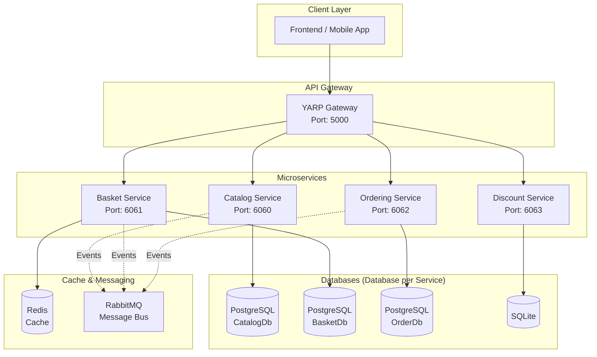
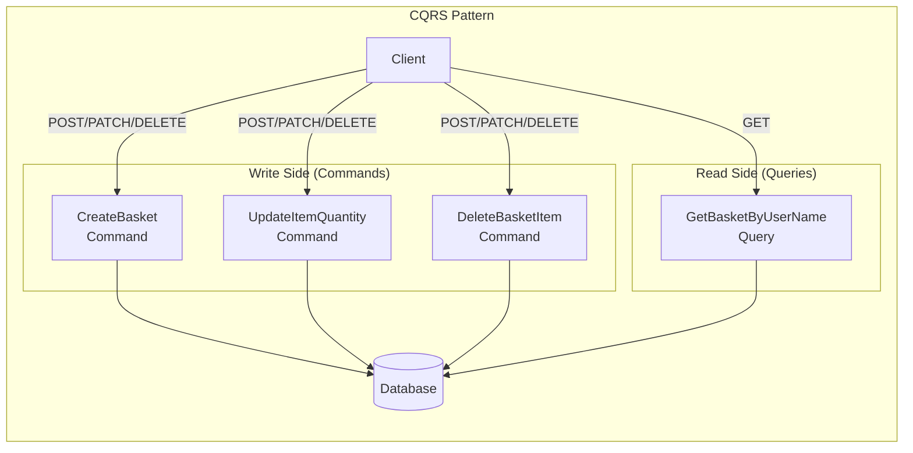
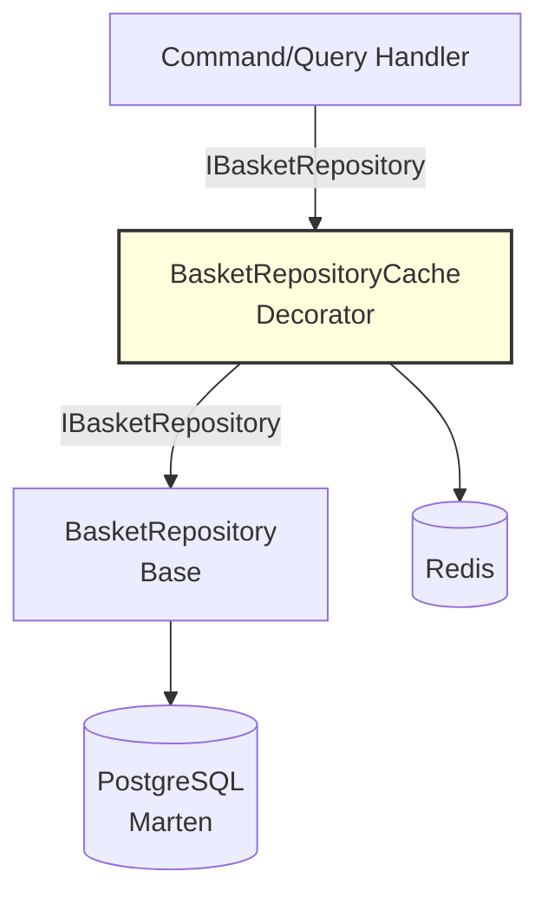
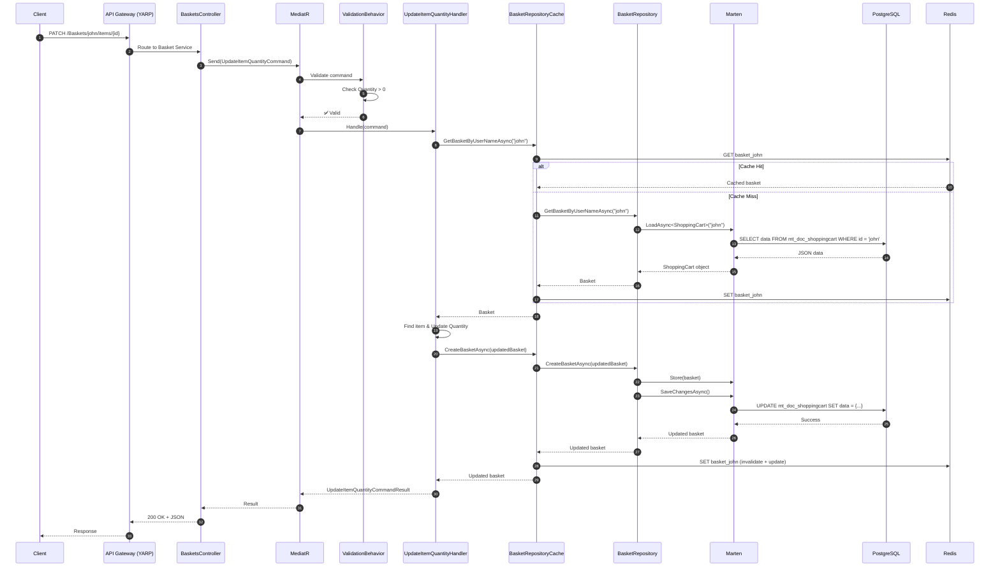

# 🏗️ Guide Architecture eShop - Pour Présentation

## 📌 Vue d'Ensemble Rapide

**eShop** est une application e-commerce construite avec une **architecture microservices** utilisant **.NET 9**, démontrant les patterns modernes : **CQRS**, **DDD**, et **Event-Driven Architecture**.



---

## 🎯 Les 5 Concepts Clés à Maîtriser

### 1. Architecture Microservices

**Principe** : Chaque service est **indépendant**, possède sa **propre base de données**, et communique via **API HTTP** ou **événements**.

| Service | Responsabilité | Base de données | Port |
|---------|----------------|-----------------|------|
| **Catalog** | Gestion des produits (CRUD) | PostgreSQL (Marten) | 6060 |
| **Basket** | Paniers utilisateurs | PostgreSQL + Redis | 6061 |
| **Ordering** | Gestion des commandes | PostgreSQL | 6062 |
| **Discount** | Codes promo et réductions | SQLite | 6063 |

**Avantages** :
- ✅ **Scalabilité indépendante** : Scaler seulement Basket si forte charge
- ✅ **Isolation des pannes** : Si Catalog tombe, Basket continue de fonctionner
- ✅ **Technologie différente par service** : PostgreSQL + Redis + SQLite

**Pattern utilisé** : **Database per Service** (ADR-004)

---

### 2. Pattern CQRS (Command Query Responsibility Segregation)

**Principe** : **Séparer** les opérations de **lecture** (Queries) et d'**écriture** (Commands).



#### Exemple Concret : UpdateItemQuantity

**Structure des fichiers** :
```
Features/Baskets/Commands/UpdateItemQuantity/
├── UpdateItemQuantityCommand.cs         # Entrée (UserName, ProductId, Quantity)
├── UpdateItemQuantityCommandResult.cs   # Sortie (IsSuccess, UpdatedCart)
├── UpdateItemQuantityCommandValidator.cs # Validation FluentValidation
└── UpdateItemQuantityCommandHandler.cs  # Logique métier
```

**Flux d'exécution** :

1. **Controller reçoit la requête** :
   ```csharp
   [HttpPatch("items/{productId:guid}")]
   public async Task<ActionResult> UpdateItemQuantity(string userName, Guid productId, ...)
   {
       var command = new UpdateItemQuantityCommand(userName, productId, quantity);
       var result = await sender.Send(command); // MediatR
       return Ok(result);
   }
   ```

2. **MediatR** trouve automatiquement le Handler correspondant

3. **ValidationBehavior** vérifie les règles (via FluentValidation) :
   ```csharp
   RuleFor(x => x.Quantity).GreaterThan(0)
   ```

4. **Handler** exécute la logique métier :
   ```csharp
   public async Task<UpdateItemQuantityCommandResult> Handle(...)
   {
       var basket = await repository.GetBasketByUserNameAsync(userName);
       var item = basket.Items.First(i => i.ProductId == productId);
       item.Quantity = quantity;
       var updated = await repository.CreateBasketAsync(basket);
       return new UpdateItemQuantityCommandResult(true, userName, updated);
   }
   ```

**Pourquoi CQRS ?**
- ✅ **Séparation des responsabilités** : Lecture ≠ Écriture
- ✅ **Optimisation différenciée** : Cache pour les queries, validation pour les commands
- ✅ **Scalabilité** : Possibilité de scaler reads et writes indépendamment

---

### 3. MediatR - Le Médiateur

**Rôle** : **Découpler** le controller du handler. Le controller ne connaît pas qui va traiter la commande.

**Configuration** (dans `Program.cs`) :
```csharp
builder.Services.AddMediatR(config =>
{
    config.RegisterServicesFromAssembly(typeof(Program).Assembly);
    config.AddOpenBehavior(typeof(ValidationBehavior<,>));  // Pipeline de validation
    config.AddOpenBehavior(typeof(LoggingBehavior<,>));     // Pipeline de logging
});
```

**Pipeline de traitement** :
```
Request → LoggingBehavior → ValidationBehavior → Handler → Response
```

**Avantages** :
- ✅ **Inversion de contrôle** : Le controller ne dépend pas du handler concret
- ✅ **Cross-cutting concerns** : Validation et logging automatiques
- ✅ **Testabilité** : Facile de mocker les handlers

---

### 4. Repository Pattern avec Decorator (Cache)

**Architecture en couches** :



**Interface commune** (`IBasketRepository`) :
```csharp
public interface IBasketRepository
{
    Task<ShoppingCart> GetBasketByUserNameAsync(string userName, ...);
    Task<ShoppingCart> CreateBasketAsync(ShoppingCart basket, ...);
    Task<bool> DeleteBasketAsync(string userName, ...);
}
```

**Implémentation de base** (`BasketRepository`) :
- Utilise **Marten** pour interagir avec PostgreSQL
- `session.Store(basket)` → Upsert (insert or update)
- `session.SaveChangesAsync()` → Commit

**Décorateur Cache** (`BasketRepositoryCache`) :
```csharp
public class BasketRepositoryCache(IBasketRepository repository, IDistributedCache cache) 
    : IBasketRepository
{
    public async Task<ShoppingCart> GetBasketByUserNameAsync(string userName, ...)
    {
        var cacheKey = $"basket_{userName}";
        var cached = await cache.GetObjectAsync<ShoppingCart>(cacheKey); // ✅ Lire cache
        
        if (cached != null) return cached; // Cache hit
        
        var basket = await repository.GetBasketByUserNameAsync(userName); // Cache miss → DB
        await cache.SetObjectAsync(cacheKey, basket); // ✅ Mettre en cache
        return basket;
    }
    
    public async Task<ShoppingCart> CreateBasketAsync(ShoppingCart basket, ...)
    {
        var created = await repository.CreateBasketAsync(basket); // ✅ Écrire en DB
        var cacheKey = $"basket_{basket.UserName}";
        await cache.SetObjectAsync(cacheKey, created); // ✅ Invalider et recréer cache
        return created;
    }
}
```

**Configuration avec Decorator Pattern** (`Program.cs`) :
```csharp
builder.Services.AddScoped<IBasketRepository, BasketRepository>();      // Base
builder.Services.Decorate<IBasketRepository, BasketRepositoryCache>(); // Decorator
```

**Pattern Cache-Aside** :
1. **Read** : Lire cache → Si absent, lire DB → Mettre en cache
2. **Write** : Écrire DB → Invalider/Mettre à jour cache

**Avantages** :
- ✅ **Performance** : Redis est 100x plus rapide que PostgreSQL
- ✅ **Séparation des préoccupations** : Cache transparent pour le handler
- ✅ **Extensibilité** : Facile d'ajouter d'autres décorateurs (logging, retry...)

---

### 5. Marten - Document Store pour PostgreSQL

**Qu'est-ce que Marten ?**
- Transforme PostgreSQL en **base de données NoSQL (document store)**
- Stocke les objets C# en **JSON** dans PostgreSQL
- Permet requêtes **LINQ** (comme Entity Framework)

**Configuration** (`Program.cs`) :
```csharp
builder.Services.AddMarten(options =>
{
    options.Connection("Server=basket.database;Port=5432;Database=BasketDb;...");
})
.UseLightweightSessions(); // Sessions sans tracking (plus rapide)
```

**Utilisation dans le Repository** :
```csharp
public class BasketRepository(IDocumentSession session) : IBasketRepository
{
    public async Task<ShoppingCart> GetBasketByUserNameAsync(string userName, ...)
    {
        // LoadAsync cherche par clé primaire (Identity)
        var basket = await session.LoadAsync<ShoppingCart>(userName);
        if (basket is null) throw new BasketNotFoundException(userName);
        return basket;
    }
    
    public async Task<ShoppingCart> CreateBasketAsync(ShoppingCart basket, ...)
    {
        session.Store(basket);              // ✅ Enregistre ou met à jour (Upsert)
        await session.SaveChangesAsync();   // ✅ Commit transaction
        return basket;
    }
}
```

**Modèle ShoppingCart** :
```csharp
public class ShoppingCart
{
    [Identity] // ← Clé primaire
    public string UserName { get; set; } = string.Empty;
    
    public IEnumerable<ShoppingCartItem> Items { get; set; } = [];
    
    public decimal Total => Items.Sum(item => item.Price * item.Quantity);
}
```

**Stockage PostgreSQL** :
- Table `mt_doc_shoppingcart`
- Colonne `data` de type `jsonb` contient :
  ```json
  {
    "UserName": "john.doe",
    "Items": [
      {"ProductId": "guid", "ProductName": "iPhone", "Quantity": 2, "Price": 999}
    ]
  }
  ```

**Avantages** :
- ✅ **Simplicité** : Pas de mapping complexe (EF)
- ✅ **Performance** : Requêtes JSONB optimisées par PostgreSQL
- ✅ **Flexibilité** : Schéma dynamique (pas de migrations)

---

## 🆕 Nouvelles Fonctionnalités Implémentées

### UpdateItemQuantity - Modifier la quantité

**Endpoint** : `PATCH /Baskets/{userName}/items/{productId}`

**Body** :
```json
{
  "quantity": 5
}
```

**Réponse** :
```json
{
  "isSuccess": true,
  "userName": "john.doe",
  "updatedCart": {
    "userName": "john.doe",
    "items": [
      {"productId": "...", "productName": "iPhone", "quantity": 5, "price": 999}
    ],
    "total": 4995
  }
}
```

---

### DeleteBasketItem - Supprimer un article

**Endpoint** : `DELETE /Baskets/{userName}/items/{productId}`

**Réponse** :
```json
{
  "isSuccess": true,
  "userName": "john.doe",
  "updatedCart": {
    "userName": "john.doe",
    "items": [],
    "total": 0
  }
}
```

---

## 🔄 Diagramme de Flux Complet - UpdateItemQuantity



---

## 🧠 Questions Fréquentes pour Présentation

### Q1 : Pourquoi utiliser CQRS ?

**Réponse** : CQRS permet de **séparer les préoccupations** :
- **Commands** : Validation stricte, logique métier complexe
- **Queries** : Optimisation pour la lecture (cache, projection)

Exemple : `GetBasketByUserName` peut utiliser le cache Redis, tandis que `UpdateItemQuantity` doit valider et écrire en DB.

---

### Q2 : Comment fonctionne le cache Redis ?

**Réponse** : Pattern **Cache-Aside** avec **Decorator** :
1. **Lecture** : Vérifier cache → Si absent, lire DB → Mettre en cache
2. **Écriture** : Écrire DB → Invalider cache → Recréer cache

Le décorateur `BasketRepositoryCache` encapsule cette logique, transparente pour le handler.

---

### Q3 : Pourquoi Marten au lieu d'Entity Framework ?

**Réponse** :
- **Simplicité** : Pas de mapping complexe, juste stocker des objets C# en JSON
- **Performance** : PostgreSQL optimise les requêtes JSONB
- **Flexibilité** : Pas besoin de migrations à chaque changement de modèle

Marten est idéal pour des **agrégats DDD** comme `ShoppingCart`.

---

### Q4 : Qu'est-ce que le pattern Decorator ?

**Réponse** : Ajouter des **responsabilités supplémentaires** à un objet **sans modifier son code**.

Exemple :
- `BasketRepository` : Logique de base (DB)
- `BasketRepositoryCache` : Ajoute le cache (décorateur)
- Les deux implémentent `IBasketRepository`

Configuration :
```csharp
builder.Services.Decorate<IBasketRepository, BasketRepositoryCache>();
```

Le handler utilise `IBasketRepository`, mais obtient le décorateur.

---

### Q5 : Comment MediatR trouve le bon Handler ?

**Réponse** : **Réflexion + Convention** :
1. La commande implémente `ICommand<UpdateItemQuantityCommandResult>`
2. Le handler implémente `ICommandHandler<UpdateItemQuantityCommand, UpdateItemQuantityCommandResult>`
3. MediatR enregistre automatiquement tous les handlers via `RegisterServicesFromAssembly`
4. Quand `sender.Send(command)` est appelé, MediatR match le type de commande avec le handler

---

### Q6 : Que se passe-t-il en cas d'erreur ?

**Réponse** : **Pipeline de gestion d'erreurs** :
1. **FluentValidation** lance `ValidationException` si règles non respectées
2. **Handler** lance `BasketNotFoundException` ou `InvalidOperationException`
3. **ExceptionHandlerMiddleware** capture les exceptions et retourne :
   - `400 Bad Request` pour validation
   - `404 Not Found` pour basket/item introuvable
   - `500 Internal Server Error` pour autres erreurs

---

## 🚀 Architecture Globale - Technologies

| Composant | Technologie | Rôle |
|-----------|------------|------|
| **Framework** | .NET 9 | Runtime et ASP.NET Core |
| **API Gateway** | YARP (Yet Another Reverse Proxy) | Routage centralisé |
| **CQRS** | MediatR | Médiateur pour Commands/Queries |
| **Validation** | FluentValidation | Validation déclarative |
| **Database** | PostgreSQL + Marten | Document store |
| **Cache** | Redis + StackExchange.Redis | Cache distribué |
| **Messaging** | RabbitMQ | Event-driven communication |
| **Container** | Docker + Docker Compose | Déploiement |
| **Health Checks** | ASP.NET Core Health Checks | Monitoring |

---

## 📚 Références des ADRs

- **ADR-001** : Choix de YARP comme API Gateway
- **ADR-002** : CQRS avec MediatR
- **ADR-003** : Event-Driven Architecture avec RabbitMQ
- **ADR-004** : Database per Service
- **ADR-005** : Containerisation avec Docker
- **ADR-006** : Pagination avec CQRS
- **ADR-007** : Opérations Granulaires sur le Panier *(nouveau)*

---

## 🎓 Points Clés pour la Présentation

1. **Microservices** = Services indépendants avec DB dédiées
2. **CQRS** = Séparation Commands (Write) / Queries (Read)
3. **MediatR** = Médiateur découplant controllers et handlers
4. **Repository + Decorator** = Abstraction DB + Cache transparent
5. **Marten** = Document store pour PostgreSQL (stockage JSON)
6. **Cache-Aside** = Pattern de cache avec Redis
7. **Validation Pipeline** = FluentValidation avec MediatR Behaviors

**Message final** : Cette architecture démontre les **best practices** modernes en .NET pour construire des applications **scalables**, **maintenables**, et **performantes**.
