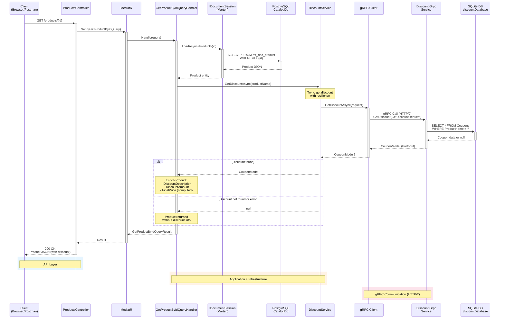
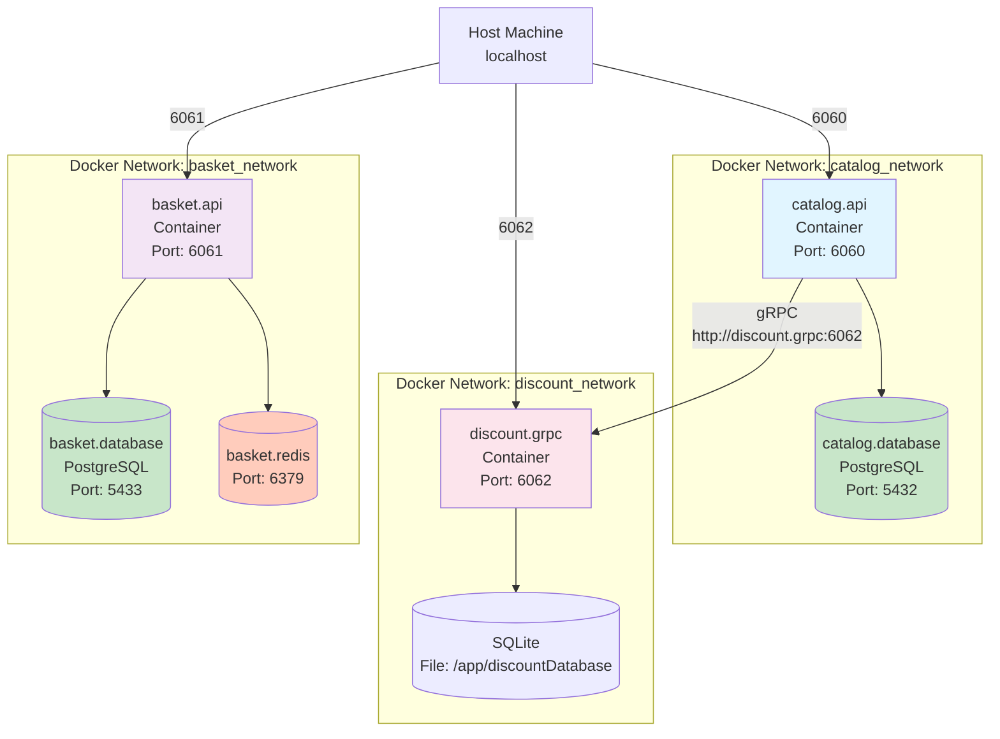
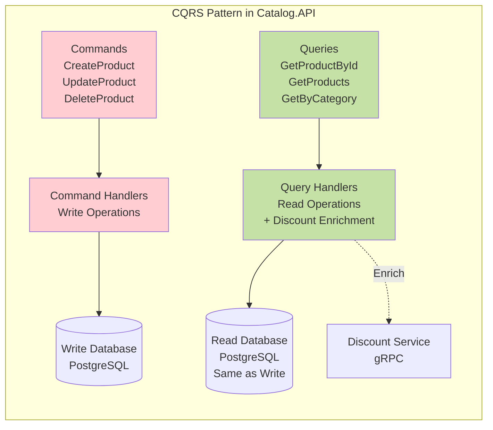

# Architecture Catalog ↔ Discount - Diagrammes Mermaid

## Diagramme de Composants (C4 Model)

```mermaid
graph TB
    subgraph "Client Layer"
        Client[Browser/Postman]
    end

    subgraph "Catalog.API Service"
        subgraph "API Layer"
            Controller[ProductsController<br/>GetProductById]
        end

        subgraph "Application Layer - CQRS"
            QueryHandler[GetProductByIdQueryHandler<br/>1. LoadAsync Product<br/>2. GetDiscountAsync<br/>3. Enrich Product<br/>4. Return Result]
        end

        subgraph "Domain Layer"
            Product[Product Model<br/>+ Id, Name, Price<br/>+ DiscountDescription<br/>+ DiscountAmount<br/>+ FinalPrice]
        end

        subgraph "Infrastructure Layer"
            IDiscountService[IDiscountService Interface]
            DiscountService[DiscountService<br/>- DiscountProtoServiceClient<br/>+ GetDiscountAsync]
        end

        subgraph "Data Access"
            Marten[IDocumentSession<br/>Marten ORM]
        end
    end

    subgraph "PostgreSQL"
        CatalogDB[(CatalogDb<br/>mt_doc_product)]
    end

    subgraph "Discount.Grpc Service"
        subgraph "gRPC Layer"
            GrpcServer[DiscountProtoService<br/>gRPC Server<br/>+ GetDiscount<br/>+ CreateDiscount<br/>+ UpdateDiscount<br/>+ DeleteDiscount]
        end

        subgraph "Protocol Buffers"
            ProtoMessages[GetDiscountRequest<br/>CouponModel<br/>ProductName, Description, Amount]
        end

        subgraph "Data Access Layer"
            DiscountData[SQLite Data Access<br/>Query by ProductName]
        end
    end

    subgraph "SQLite"
        DiscountDB[(discountDatabase<br/>Coupons Table)]
    end

    %% Connections
    Client -->|HTTP GET /products/{id}| Controller
    Controller -->|MediatR Send| QueryHandler
    QueryHandler -->|LoadAsync| Marten
    Marten -->|Query| CatalogDB
    QueryHandler -->|GetDiscountAsync| IDiscountService
    IDiscountService -.->|implements| DiscountService
    DiscountService -->|gRPC Call<br/>HTTP/2 + Protobuf| GrpcServer
    GrpcServer -->|Use| ProtoMessages
    GrpcServer -->|Query| DiscountData
    DiscountData -->|SELECT| DiscountDB
    QueryHandler -->|Uses| Product

    %% Styling
    classDef apiLayer fill:#e1f5ff,stroke:#01579b,stroke-width:2px
    classDef domainLayer fill:#f3e5f5,stroke:#4a148c,stroke-width:2px
    classDef infraLayer fill:#fff3e0,stroke:#e65100,stroke-width:2px
    classDef dataLayer fill:#e8f5e9,stroke:#1b5e20,stroke-width:2px
    classDef grpcLayer fill:#fce4ec,stroke:#880e4f,stroke-width:2px

    class Controller apiLayer
    class QueryHandler,Product domainLayer
    class IDiscountService,DiscountService,Marten infraLayer
    class CatalogDB,DiscountDB dataLayer
    class GrpcServer,ProtoMessages grpcLayer
```

## Diagramme de Séquence



## Diagramme d'Architecture Simplifiée

```mermaid
flowchart LR
    subgraph Client
        A[Client HTTP]
    end

    subgraph CatalogAPI["Catalog.API (Port 6060)"]
        B[Controller]
        C[CQRS Handler]
        D[DiscountService]
        E[(PostgreSQL<br/>CatalogDb)]
    end

    subgraph DiscountGrpc["Discount.Grpc (Port 6062)"]
        F[gRPC Server]
        G[(SQLite<br/>discountDatabase)]
    end

    A -->|1. HTTP/REST<br/>GET /products/{id}| B
    B -->|2. MediatR| C
    C -->|3. Load Product| E
    C -->|4. Get Discount| D
    D -.->|5. gRPC/HTTP2<br/>Protocol Buffers| F
    F -->|6. Query| G
    G -.->|7. Coupon| F
    F -.->|8. CouponModel| D
    D -->|9. Discount Info| C
    C -->|10. Enriched Product| B
    B -->|11. JSON Response| A

    style A fill:#e3f2fd
    style CatalogAPI fill:#fff3e0
    style DiscountGrpc fill:#fce4ec
    style E fill:#c8e6c9
    style G fill:#c8e6c9
```

## Diagramme de Déploiement Docker



## Vue d'Ensemble - Pattern CQRS



---

## Comment utiliser ces diagrammes

### Dans GitHub/GitLab
Les fichiers `.md` avec code Mermaid s'affichent automatiquement dans les README.

### Dans VSCode
Installez l'extension **"Markdown Preview Mermaid Support"**

### En ligne
Copiez le code dans:
- https://mermaid.live/
- https://mermaid.ink/

### Dans la documentation
Ces diagrammes peuvent être intégrés dans:
- Confluence
- Notion
- Documentation technique
- Rapports de projet

